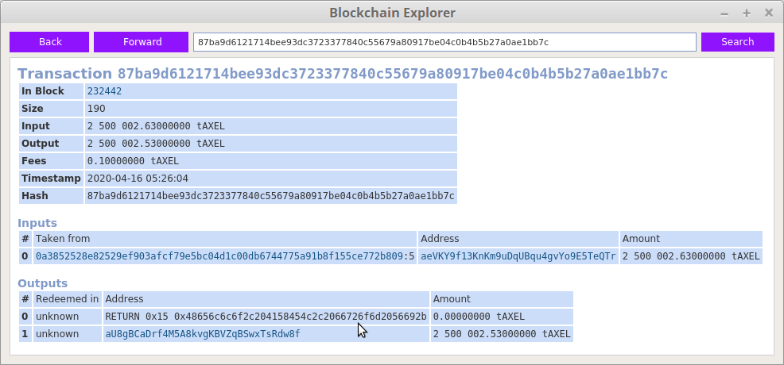

# axel-blockchain-enhancement

A demo for storing/getting data to/from AXEL blockchain with using OP_RETURN, and extra demo of file signing/verifying based on *signmessage* and *verifymessage* AXEL blockchain API calls

## Sending your message to AXEL blockchain

`node ./send.js --rpcuser=<your_rpcuser> --rpcpassword=<your_rpcpassword> --msg=<your_msg>`

## Searching for your message inside AXEL blockchain

`node ./show.js --rpcuser=<your_rpcuser> --rpcpassword=<your_rpcpassword>`

## Demo (screenshot)

[Demo log during executing on testnet](demo-testnet.md).

## File signing based on *signmessage* AXEL blockchain API call
`node ./sign-file.js --rpcuser=<my_rpcuser> --rpcpassword=<my_rpcpassword> --address=<your_address> --file=<your_file>`

## File verifying based on *verifymessage* AXEL blockchain API call
`node ./verify-file.js --rpcuser=<my_rpcuser> --rpcpassword=<my_rpcpassword> --address=<your_address> --sig=<your_sig> --file=<your_file>`
